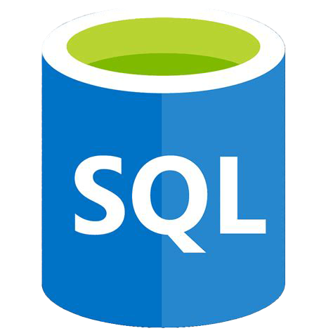
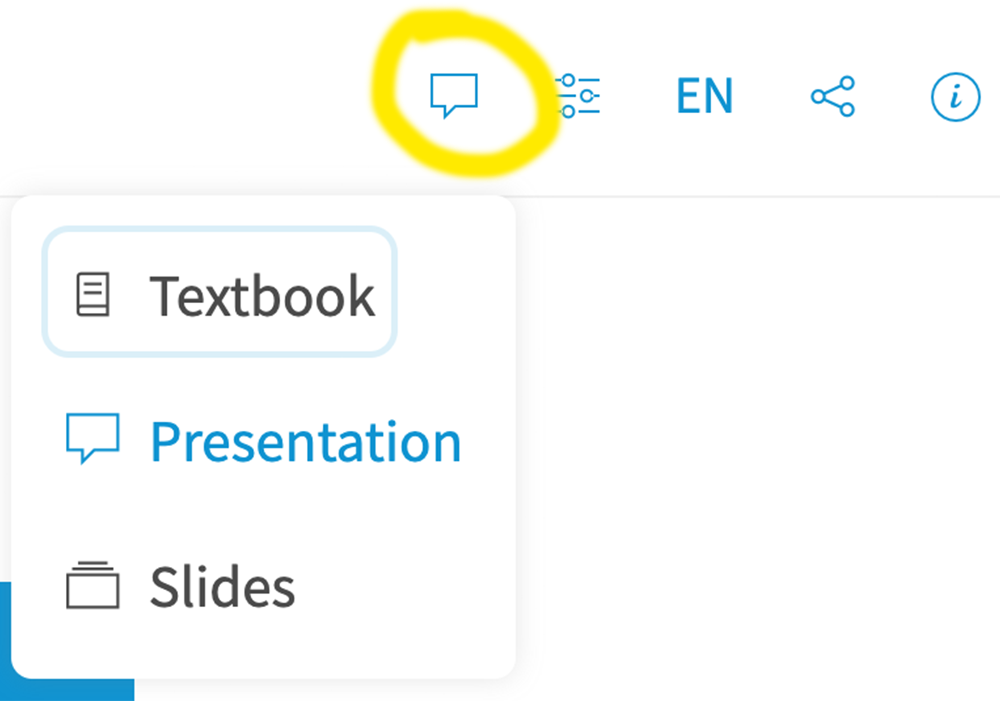
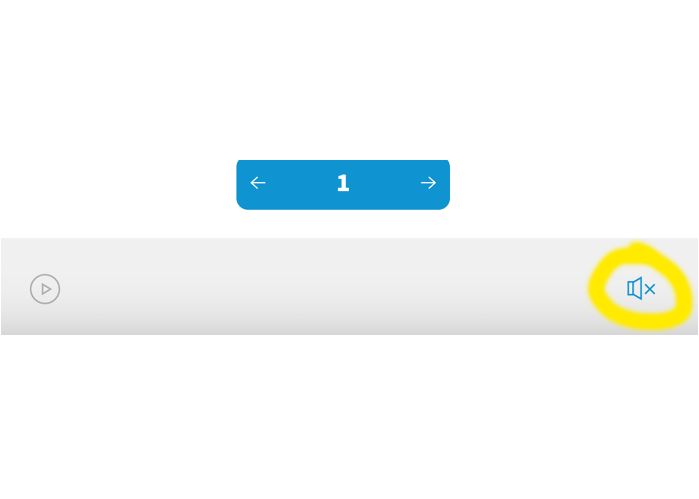

<!--
author: Elizabeth Drellich
email: franzenr@chop.edu
version: 1.0.0
current_version_description: Initial version
module_type: slides
docs_version: 3.0.0
language: en
narrator: US English Female
mode: Presentation
classroom: enable
@onload: window.LIA.settings.sound = false

title: SQL Intermediate Level

comment:  Learn how to do intermediate SQL queries on single tables, by using code, hands-on.

long_description: Do you want to learn intermediate Structured Query Language (SQL) for more precise and complex data querying on single tables?  This module will give you hands on experience with single-table queries using keywords including CASE, LIKE, GROUP BY, and HAVING, along with a number of aggregate functions like COUNT and AVG.  This module is appropriate for people who are comfortable writing basic SQL queries and are ready to practice more advanced skills.

estimated_time_in_minutes: 60

@pre_reqs
Some experience writing basic SQL code (SELECT, FROM, WHERE) is expected in this module.  If you would like a code-free overview to SQL we recommend our module [Demystifying SQL](https://liascript.github.io/course/?https://raw.githubusercontent.com/arcus/education_modules/main/demystifying_sql/demystifying_sql.md).  If you need to develop basic SQL fluency we recommend our module [SQL Basics](https://liascript.github.io/course/?https://raw.githubusercontent.com/arcus/education_modules/main/sql_basics/sql_basics.md).
@end

@learning_objectives  
After completion of this module, learners will be able to:

- Create new data classifications using `CASE` statements
- Find text that matches a given pattern using `LIKE` statements
- Use `GROUP BY` and `HAVING` statements along with aggregate functions to understand group characteristics
@end

good_first_module: false
data_domain: ehr
data_task: data_wrangling
collection: learn_to_code
coding_required: true
coding_level: intermediate
coding_language: sql
sequence_name: sql

@sets_you_up_for

@end

@depends_on_knowledge_available_in

@end

@version_history
No previous versions.
@end

repo_link: [GitHub repository for these materials](https://github.com/arcus/arcus_skill_series_sql)
module_link: [SQL Intermediate Level](https://liascript.github.io/course/?https://raw.githubusercontent.com/arcus/education_modules/main/sql_intermediate/sql_intermediate.md)

import: https://raw.githubusercontent.com/arcus/education_modules/main/_module_templates/macros.md
import: https://raw.githubusercontent.com/arcus/education_modules/alasql_data_type_improvement/_module_templates/macros_sql.md

big: <b style="font-size: 1.25em;">@0</b>
center: <div style="text-align: center;">@0</div>
colorhighlight: <b style="font-size: 1.15em; color: rgba(var(--color-highlight));">@0</b>

@sql_series_slide

<div style = "text-align: center; font-weight: bold;font-size: 1.5em; color: white; background-color: rgba(var(--color-highlight));">Welcome to the Arcus Education Skill Series!</div>

<br>

<div style = "align-items: center; display: flex;">
<div style = "margin: 1rem; max-width: 30%; float:left; padding-right:4em;">
</div>
<div style = "margin: 1rem auto; max-width: 65%; float:left;">
<h3>Beyond the Spreadsheet: Understanding SQL and Relational Databases</h3> 

</div>
</div>
@end

@todays_talk
@big(@title)

After this session, learners will be able to:

@learning_objectives
@end

@about_these_slides

These slides were created with [LiaScript](https://liascript.github.io/), an open source markdown parser for writing educational content.

All of the speaker notes from today's talk are saved in the slides themselves -- try changing the view to Textbook and it will integrate the text from the notes into the slides themselves, or turn on the sound at the bottom to hear the notes read out loud as you go through. 

<div style = "align-items: center; display: flex;">
<div style = "margin-left: 10%; max-width: 25%; float:left; border-style: solid; border-color: rgba(var(--color-highlight));">

</div>
<div style = "margin-right: 10%; max-width: 25%; float:right; border-style: solid; border-color: rgba(var(--color-highlight));">

</div>
</div>

The content from this talk is also available as an online self-paced tutorial: @module_link 

For all of the files and information from this talk, go to our @repo_link 

@end

@teams_polls 

@big(Today's presentation will include interactive content!)

The best way to learn is to practice!

When we reach 💫 **Your Turn** sections, you'll have a chance to write or edit some SQL code of your own. There will also be opportunities to ask questions, and there will be some polls and other prompts in the chat to respond to.

@end
-->


# SQL Intermediate Level
@sql_series_slide

--{{0}}--
Welcome! 
I'm Elizabeth Drellich, and I use she/her pronouns. 
I'm a member of CHOP's Data Education Collaborative and I sit on the Arcus Education team in DBHi. 
Today's talk is the fourth in our five-part series on sequel, or S-Q-L.  
Today's webinar will be recorded, so please leave your cameras and mics turned off until the question time at the end.
If you do have questions that come up during the talk, feel free to put them in the chat. 
So with that, let's get started!

## Today's talk

@todays_talk 

--{{0}}--
Today, we'll be learning how to do some more advanced SQL queries on single tables. This is a hands-on webinar -- we'll be writing some real SQL code! If that sounds daunting -- don't worry. I'll provide plenty of scaffolding, and we'll work through things together. 

--{{0}}--
In the last webinar in this series my colleague Rose Franzen taught you how to compose simple queries with SELECT, WHERE, FROM, DISTINCT, AS, and ORDER BY. Today, after a quick review of those commands, we are going to learn how to write more complicated queries using CASE, LIKE, and GROUP BY. Along the way we will learn about some aggregate functions, as well as practice and refresh the skills you already know.

## Thank you!

<div class = "gratitude">
<b style="color: rgb(var(--color-highlight));">Thank you!</b><br>

Material for this talk is based closely on the DART module @module_link, written by Peter Camacho and Joy Payton.

</div>

--{{0}}--
Many thanks to Peter and Joy for their work developing this excellent content!

Our webinar today will **not** cover all of the topics in their module, as we simply won't have time, so I suggest you check out the module after our session. 

## Learn by doing

@teams_polls

--{{0}}--
We're firm believers that the best way to learn is to practice! As I mentioned before, we will have opportunities to practice writing our own SQL code today using a fake patient database. There will also be some short quizzes to help solidify your understanding as we go.

--{{0}}--
With that being said, lets jump in!

## SQL: A Brief Refresher

**SQL** (**S**tructured **Q**uery **L**anguage) is a programming language that for more than four decades has been used to interact with **relational databases**.

A relational database is a data storage solution that stores data tables, which are comprised of columns (also called 'fields') and rows.

--{{0}}--
First, let's quickly review some key concepts from our November, December, and January sessions. 
"Sequel", or S-Q-L (either pronunciation is fine) stands for Structured Query Language. SQL is a programming language used to interact with Relational Databases. 

--{{0}}--
Relational databases consist of many different data tables. Today we will only be working with data from **one** table at a time, even though the three tables we will work with are stored in a single relational database. To learn more about combining data from more than one table, be sure to catch our final presentation in the series on SQL Joins (dates on the final slide).

{{1}}
*****
<h4> What SQL is for: </h4>
isolating and combining just the data you're interested in, such as:

 * extracting columns you're interested in
 * filtering to just the data that meets specific criteria
*****
--{{1}}--
SQL is great at working with rectangular data, data that is stored in tables with rows and columns / fields. 

{{2}}
*****
<h4> What SQL is **NOT** good for: </h4>

* fine tuned statistical, linguistic, or data visualization needs
*****
--{{2}}--
However, it's not great for fine-tuned statistical, linguistic, or data visualization purposes.  SQL is therefore a tool that is often partnered with other tools like R or Python, which are better suited for work like statistical analysis.

### Flavors of SQL

--{{0}}--
SQL is technically not just one thing -- there are a variety of different implementations. Although all SQL implementations have a similar structure, and the same basic syntax, each different SQL database product often has its own minor variations in dialect.

--{{0}}--
Colloquially people often refer to the different SQL dialects as different "flavors" of SQL.

Some popular "flavors" of SQL:

* [**MySQL**](https://www.mysql.com/) (open source)
* [**SQLite**](https://www.sqlite.org) (open source)
* [**PostgreSQL**](https://www.postgresql.org/) (open source)
* [**Oracle**](https://www.oracle.com/database/technologies/appdev/sql.html) (proprietary)
* [**BigQuery**](https://cloud.google.com/bigquery/docs/reference/standard-sql/query-syntax) (proprietary)


--{{0}}--
The most common difference between different SQL "flavors" are the availability of different functions that users can use for data manipulation, as well as the types of error messages that will be returned to the user when running code with syntax issues. There will be a few times during this webinar when I will point out that the flavor of SQL we are using today is impacting the outputs we get. 

--{{0}}--
Because different flavors can have different outputs, knowing the specific flavor or dialect of SQL your database uses is especially useful when first getting started writing queries and troubleshooting errors. Whenever you search for documentation online or are troubleshooting, you'll want to be sure to include the name of the "flavor" you're working with in your search terms. 

{{1}}
*****
<h3>Flavor of the Day: [**AlaSQL**](https://alasql.org/) </h3> 
*****

--{{1}}-- 
In the hands-on portion of this webinar, we'll be using a form of SQL that actually runs in your web browser as you look at these pages.  This lightweight SQL engine is called "AlaSQL".  We pre-populated some tables for you to experiment with in this presentation.  These tables are filled with fabricated data meant to look a little like an electronic health record (EHR).  Rest assured that this data was completely invented, although it might look realistic!

### SELECT, FROM, WHERE

--{{0}}--
Before we learn any new SQL commands, let's do a quick review of the commands SELECT, FROM, and WHERE that we learned about last month.


The basic structure of a SQL query is

```sql
SELECT
  fields
FROM dataset_name.table_name
WHERE conditional_statement
```


--{{1}}--
To start exploring the `patients` table from the `alasql` database, let's first take a look at all the whole table.

{{1}}
*****
Use the asterisk as a wildcard to select all fields:

```sql
SELECT *
FROM alasql.patients
```
@AlaSQL.eval("#dataTable_select_wildcard")

<details open>

<summary>**Results of Query (click to collapse or expand this section)**</summary>

<table id="dataTable_select_wildcard" border="1"></table>

</details><br/><br/>

<div style = "display:none;">

@AlaSQL.buildTable_patients

</div>

*****

--{{2}}--
Once you know what the column names are, you can select only the columns (or fields) you want.

{{2}}
*****
We recommend using dot notation and comma-first style to list the specific fields you want to see.

```sql
SELECT 
  patients.id
  ,patients.address
  ,patients.city
  ,patients.county
  ,patients.state
FROM alasql.patients
```
@AlaSQL.eval("#dataTable_select_list_fields")

<details open>

<summary>**Results of Query (click to collapse or expand this section)**</summary>

<table id="dataTable_select_list_fields" border="1"></table>

</details><br/><br/>

<div style = "display:none;">

@AlaSQL.buildTable_patients

</div>

*****
--{{3}}--

The **WHERE clause**, using the `WHERE` keyword, is the section of your query used to specify any "filtering logic" that should be applied to your query before returning any output.  It's optional but very useful.

--{{3}}-- 
As an example, here's how you'd filter the output to only include records for a specific county.

{{3}}
*****
Use WHERE to return only rows for which a conditional statement is true:

```sql
SELECT 
  patients.id
  ,patients.address
  ,patients.city
  ,patients.county
  ,patients.state
FROM alasql.patients
WHERE
	patients.county = "Suffolk County";
```
@AlaSQL.eval("#dataTable_where")

<details open>

<summary>**Results of Query (click to collapse or expand this section)**</summary>

<table id="dataTable_where" border="1"></table>

</details><br/><br/>

<div style = "display:none;">

@AlaSQL.buildTable_patients

</div>

*****

--{{3}}--
We will also be seeing the `DISTINCT` and `ORDER BY` functions again today, and will review them when we get there.

## `CASE`

--{{0}}--
Our miniature database has three tables, `patients`, `allergies`, and `observations`. 

Let's look at the observations of "Peanut IgE Ab in Serum" in the `alasql.observations` table.


--{{0}}--
We have already filtered this data using a `WHERE` statement to only look at the observations of Peanut IgE Ab in Serum. If we wanted to see what other types of observations are in the table, we could comment out the last two lines of the query to get the whole table.


```sql
SELECT
	observations.*
FROM alasql.observations
WHERE
	observations.description = 'Peanut IgE Ab in Serum';
```
@AlaSQL.eval("#dataTable_observations")

<details open>

<summary>**Results of Query (click to collapse or expand this section)**</summary>

<table id="dataTable_observations" border="1"></table><br>

</details><br/><br/>

<div style = "display:none;">

@AlaSQL.buildTable_observations

</div>


--{{0}}--
Taking a closer look at the `observation_value` field, those numbers would be a lot more useful if we knew what those numeric values indicate.

--{{0}}--
Often when working with data, you will come across the need to define your own custom categories or groupings given some raw row data as input. For example, you might have hemocrit levels that you want to categorize as _normal_, _borderline_, or _abnormal_. This is where the `CASE` statement can come in handy!

### Structure

--{{0}}--
The `CASE` statement is used to produce conditional row-level output based on columns/rows provided as input.  It's like an "if" statement in other languages, but with multiple possibilities, or "cases," that are considered. Let's take a look at a generic example, then we will practice with our dataset.


The `CASE` statement has 4 main components (shown below).


```sql
CASE                --COMPONENT 1: start tag of the case statement.
  WHEN (…) THEN (…) --COMPONENT 2: conditional when "some input" then "some output" logic.
  …                 --             additional "when / then" possibilities continue,
                    --             as many as you need.
  ELSE (…)          --COMPONENT 3: declaration of default value to be returned if
                    --             none of the when/then conditions are met.
END                 --COMPONENT 4: end tag of case statement with optional
                    --             field name (for instance, `AS patient_category`)
```


--{{0}}--
We will look at these components one by one, starting in the middle of the statement and working our way out.

{{1}}
*****
Conditional statements:

```sql
  WHEN conditional_statement THEN some_output  
```
*****

--{{1}}--
Conditional statements in SQL use this `WHEN`/`THEN` form. If you are used to other programming languages, you might be used to "if/then" statements, and this is very similar. `WHEN` the conditional statement is true, `THEN` the designated output will be returned to you.

--{{1}}--
You can have as many conditional statements as you want. Be aware, however, that for each row, SQL will only return one output, corresponding to the first time a condition is true.

{{2}}
*****
You include have multiple conditional statements.

```sql
  WHEN patients.age < 1 THEN 'infant'
  WHEN patients.age <= 12 THEN 'child'
  WHEN patients.age <= 17 THEN 'teen'
```
*****

--{{2}}--
Let's consider what these statements would do in a row where `patients.age` (a field that isn't actually in our `patients` table) is 10. That row would not be categorized as an infant because 10 is greater than 1, but it would be categorized as a child because 10 is less than or equal to 12. However, even though 10 is less than 17, row will not be categorized as "teen" because it has _already_ been put in the "child" category. 

{{3}}
*****
`ELSE` comes after all of the `WHEN`/`THEN` statements and tells SQL what to return if none of the cases are true. 

```sql
  WHEN patients.age < 1 THEN 'infant'
  WHEN patients.age <= 12 THEN 'child'
  WHEN patients.age <= 17 THEN 'teen'
  ELSE 'adult'
```
*****

--{{3}}--
If no `ELSE` clause is explicitly specified SQL imposes a condition of `ELSE NULL` by default.  We strongly encourage you to always include an `ELSE` clause even if you like the default value of `ELSE NULL`, to make your code more explicit.

{{4}}
*****
Open the statement with `CASE` and close it with `END`.

```sql
CASE
  WHEN patients.age < 1 THEN 'infant'
  WHEN patients.age <= 12 THEN 'child'
  WHEN patients.age <= 17 THEN 'teen'
  ELSE 'adult'
END
```
*****
--{{4}}--
The indentation before each of the `WHEN` statements and the `ELSE` statement are for use as human readers of this code. SQL doesn't need those lines to be indented, but it makes it a lot clearer to us where this block of code starts and ends.

--{{4}}--
We have started with a lot of theory because `CASE` statements are complicated, so let's return to that observations table and see how using a `CASE` statement helps us understand the data.

### Example


A `CASE` statement goes between the `SELECT` statement and the `FROM` statement in a SQL query.

```sql
SELECT
	observations.*
	,CASE
        WHEN observations.observation_value >= 17.5 THEN 'Strongly Positive'
        WHEN observations.observation_value >= .7 THEN 'Positive'
        WHEN observations.observation_value >= 0.35 THEN 'Equivocal'
        WHEN observations.observation_value >= 0.10 THEN 'Borderline'
        WHEN observations.observation_value < 0.10 THEN 'Negative'
        ELSE NULL
	END
FROM alasql.observations
WHERE
	observations.description = 'Peanut IgE Ab in Serum';
```
@AlaSQL.eval("#dataTable_observations_cases")

<details open>

<summary>**Results of Query (click to collapse or expand this section)**</summary>

<table id="dataTable_observations_cases" border="1"></table><br>

</details><br/><br/>

<div style = "display:none;">

@AlaSQL.buildTable_observations

</div>


--{{0}}--
When we run this code, we get a new column with the outcomes of our conditional `WHEN`/`THEN` statements in it. The data here looks great, we can read immediately that all three Peanut IgE Ab results were positive, two of them strongly positive so. But we have this ugly column name, with the entire `CASE` statement.


--{{1}}--
We can make that column heading much nicer by telling SQL what we want it to be called. At the end of the `CASE` statement, immediately after the word `END`, add `AS interpretation` and run the code again. Giving this new column an alias will make it much easier to use and understand.

{{1}}
******
Follow a closing `END` with `AS` to give your new column a useful name.

```sql
CASE
  WHEN (…) THEN (…)
  ELSE (…)
END AS new_column_name
```
******

### 💫 **Your Turn 1** 

You're studying attitudes about smoking and will issue a survey in phases.  Phase 1 will go out to residents of Plymouth County, Phase 2 will go out to residents of Essex County and Phase 3 will go out to Barnstable County.  Finish the following query such that you get the patient name, county, and a new column called `phase`. 

```sql
SELECT
  patients.first
  ,patients.last
  ,patients.county
  ,CASE
    WHEN      THEN "Phase 1"
    WHEN      THEN "Phase 2"
    WHEN      THEN "Phase 3"
    ELSE NULL
  END
FROM alasql.patients;
```
@AlaSQL.eval("#dataTable_case_your_turn")

<details open>

<summary>**Results of Query (click to collapse or expand this section)**</summary>

<table id="dataTable_case_your_turn" border="1"></table><br>

</details><br/><br/>

<div style = "display:none;">

@AlaSQL.buildTable_patients

</div>

--{{0}}--
I'm going to give you a few minutes to try this on your own. There will be a comment in the chat for you to "like" when you are done, and when we have a quorum, we will complete the query together.

<details>
<summary style = "margin-bottom: 1rem;">*Going through these slides on your own? Click here to reveal answer once you're done!*</summary>

Try:

```sql
SELECT
  patients.first
  ,patients.last
  ,patients.county
  ,CASE
    WHEN patients.county = "Plymouth County" THEN "Phase 1"
    WHEN patients.county = "Essex County" THEN "Phase 2"
    WHEN patients.county = "Barnstable County" THEN "Phase 3"
    ELSE NULL
  END AS phase
FROM alasql.patients;
```

</details>


## `LIKE`
--{{0}}--
So far every time we have created a query, we have needed to know the exact form the data in our table takes. To see what I mean, let's take a closer look at the allergies table.

Use `SELECT DISTINCT` to discover how many distinct allergies appear in the `allergies` table.

```sql
SELECT DISTINCT allergies.description
FROM alasql.allergies;
```
@AlaSQL.eval("#dataTable_allergies")

<details open>

<summary>**Results of Query (click to collapse or expand this section)**</summary>

<table id="dataTable_allergies" border="1"></table><br>

</details><br/><br/>

<div style = "display:none;">

@AlaSQL.buildTable_allergies

</div>
--{{0}}--
Say you are interested in all types of pollen allergies, but not other allergies. With the tools we already have, you could get that information using a where statement.

{{1}}
*****
To get all pollen allergies from the `allergies` table with just a `WHERE` statement, you need to have each possible entry spelled out in its entirety.

```sql
SELECT *
FROM alasql.allergies
WHERE
  allergies.description = "Allergy to tree pollen"
  OR
  allergies.description = "Allergy to grass pollen";
```
*****

--{{1}}--
In the very small table we are working with here, this method works fine. But if we were looking at a real patient data, there might be hundreds of types of pollen allergies specified. Moreover, if these data were entered by hand, the same allergy might show up as both "Allergy to grass pollen" and "grass pollen allergy" with different wording and different capitalization. Or maybe a new patient comes in who has a different pollen allergy, will you need to update your whole query?

{{2}}
*****
How can we get all the pollen allergies without having perfectly type them out in a very long `WHERE` statement? We need the `LIKE` operator to help us out.
*****

### Structure

`LIKE` operators let you compare textual data to a pattern rather than checking if two strings are equal with `=`.

```sql
SELECT *
FROM alasql.allergies
WHERE
    allergies.description LIKE a_particular_pattern;
```

This action is known as **pattern matching**, and can let you filter on row values that are similar, but not exact matches.

### Patterns

The `LIKE` operator uses 2 distinct **wildcard characters** that let you make patterns where some characters are unknown.

| Wildcard Characters | Description |
| --- | --- |
| `%` | "Wildcard" for 0 or more characters. |
| `_` | "Wildcard" for exactly 1 characters. |

--{{0}}--
Wildcard characters let us build patterns to compare with a string of text data. Let's take a closer look at some examples using the `%` wildcard.

--{{1}}--
Putting a `%` symbol just at the beginning means anything can come before the characters in pollen, but the data must _end_ with "pollen". 

{{1}}
*****
`%pollen` matches "Allergy to tree pollen" 
*****

--{{1}}--
If instead the `%` symbol is only after the string `pollen`, a phrase would have to start with the letters "pollen" to be a match.

{{2}}
*****
`pollen%` matches "pollen allergy - trees"
*****

--{{2}}--
Capitalization matters to the `LIKE` operator, if the P were capitalized in "Pollen allergy - trees" that would not be a match. We will return to the problem of capitalization in a moment.

--{{3}}--
To match both of these constructions, as well as data like "Tree pollen allergy," we can put `%` symbols both before and after.

{{3}}
*****
`%pollen%` matches both, and also "Tree pollen allergy"
****

--{{4}}--
In the same way we needed quotes around the data we wanted to match exactly, the entire string of characters, wildcards included, must be enclosed in quotes.

{{4}}
*****
Surround the pattern in quotes:

`... LIKE '%pollen%'` or `... LIKE "%pollen%"`
*****

### Example

--{{0}}--
Let's apply this structure to finding the pollen allergies from our `alasql.allergies` table.

```sql
SELECT *
FROM alasql.allergies
WHERE
    allergies.description LIKE '%pollen';
```
@AlaSQL.eval("#dataTable_like_example")

<details open>

<summary>**Results of Query (click to collapse or expand this section)**</summary>

<table id="dataTable_like_example" border="1"></table><br>

</details><br/><br/>

<div style = "display:none;">

@AlaSQL.buildTable_allergies

</div>

--{{0}}--
If we had a larger collection of possible allergies, this query would return all of the rows in which the character string "pollen" appears in the `allergies.description` field. 

--{{0}}--
But what if there was an entry where the word "Pollen" was capitalized? The `LIKE` operator cares about capitalization, a lower case `p` and an upper case `P` are not the same characters.

--{{1}}--
The `LOWER()` (or `UPPER()`) operator can help us out by taking the data in a field and making all of the characters lowercase (or uppercase).

{{1}}
Wrap both sides of the `LIKE` statement in `LOWER()` to make sure the query returns both capital and lowercase versions of our pattern. 


### 💫 **Your Turn 2** 

You'd like to research patients born in the 1970s (so any year starting 197\_ would work).  Use a `LIKE` statement to enrich the query below and find the patient set you care about.

```sql
SELECT
  patients.id
  ,patients.birthdate
FROM alasql.patients;
```
@AlaSQL.eval("#dataTable_like_your_turn")

<details open>

<summary>**Results of Query (click to collapse or expand this section)**</summary>

<table id="dataTable_like_your_turn" border="1"></table><br>

</details><br/><br/>

<div style = "display:none;">

@AlaSQL.buildTable_patients

</div>

--{{0}}--
I'm going to give you a few minutes to try this on your own. There will be a comment in the chat for you to "like" when you are done, and when we have a quorum, we will complete the query together.

<details>
<summary style = "margin-bottom: 1rem;">*Going through these slides on your own? Click here to reveal answer once you're done!*</summary>

Try:

```sql
SELECT
  patients.id
  ,patients.birthdate
FROM alasql.patients
WHERE patients.birthdate LIKE '197%';
```

</details>


## Aggregate Functions

**Aggregate functions** can be used to get a single value related the values for multiple rows of data in some meaningful way.  

--{{0}}--
This aggregation could be a numerical statistic, like the sum or standard deviation of a number of rows, or it could pull out a special value, like the minimum or maximum value (this works as well for strings, in which case it would be the first or last value in alphabetical order). There are many other possibilities as well, like giving a count of rows or pulling a value at random from the rows.

Commonly used aggregate functions:

|Function|Description|
|:---|:---|
|`COUNT()`|Returns the count of the number of non-null values among the column(s)/rows provided as input.|
|`SUM()`|Returns the summation of all values from a column provided as input.|
|`MIN()`|Returns the minimum value from a column provided as input.|
|`MAX()`|Returns the maximum value from a column provided as input.|
|`AVG()`|Returns the numerical mean of all values from a column provided as input.|

To count the rows in a table, use `COUNT(*)`.

These aggregate functions will ignore null values if you apply them to a specific column:

```sql
SELECT 
  COUNT(*) AS total_rows
  ,COUNT(patients.birthdate) AS births
  ,COUNT(patients.deathdate) AS deaths
FROM alasql.patients;
```
@AlaSQL.eval("#dataTable_count_example")

<details open>

<summary>**Results of Query (click to collapse or expand this section)**</summary>

<table id="dataTable_count_example" border="1"></table><br>

</details><br/><br/>


<div style = "display:none;">

@AlaSQL.buildTable_patients

</div>

--{{0}}--
The count function shows us that the `patients` table has 25 rows, and all of those 25 rows contains a `birthdate`. But most rows have a `NULL` vaule for the `deathdate`.

--{{1}}--
SQL will do its best to use the aggregate functions regardless of what type of data is in the column, but the outputs will make the most sense if the data type is what the function expects. For example `SUM` might return a value for a column that isn't numeric, but it isn't particularly useful information. The `MAX` and `MIN` functions, on the other hand, can be useful when used on text data: they will order the text alphabetically.

{{1}}
*****

```sql
SELECT 
  SUM(patients.expenses)
  ,MAX(patients.last)
  ,MIN(patients.first)
  ,AVG(patients.coverage)
FROM alasql.patients;
```
@AlaSQL.eval("#dataTable_aggregate_example")

<details open>

<summary>**Results of Query (click to collapse or expand this section)**</summary>

<table id="dataTable_aggregate_example" border="1"></table><br>

</details><br/><br/>


<div style = "display:none;">

@AlaSQL.buildTable_patients

</div>

*****

--{{1}}--
We can see how SQL tries to adapt by changing which columns we try to sum or average. Let's see how all four functions work on the column `patients.sex`. Summing the `patients.sex` column just concatenates all of the entries, while averaging `patient.sex` returns a null value. These outputs might differ depending on what flavor of SQL you are using. While AlaSQL does return a null value when it can't parse an aggregate statement, other flavors of SQL may give you error messages.

### `GROUP BY`

--{{0}}--
Often, you are interested in statistics by group, such as the average BMI for men and for women, or the standard deviation of reading test scores in teens with ADHD, depression, neither condition, or both conditions.


The `GROUP BY` clause is used to group column results into only the unique/distinct values among them. 

It is used in combination with aggregate functions to generate summary statistics about the larger dataset that was "grouped" (i.e. "collapsed") by `GROUP BY`. These can be tricky, so let's see a `GROUP BY` function in action before we examine how it works in more depth.

```sql
SELECT 
  patients.sex
  ,COUNT(patients.birthdate) AS births
  ,COUNT(patients.deathdate) AS deaths
FROM alasql.patients
GROUP BY
    patients.sex;
```
@AlaSQL.eval("#dataTable_group_by_example")

<details open>

<summary>**Results of Query (click to collapse or expand this section)**</summary>

<table id="dataTable_group_by_example" border="1"></table><br>

</details><br/><br/>


<div style = "display:none;">

@AlaSQL.buildTable_patients

</div>

{{1}}
*****
`GROUP BY` aggregations like the one above can be confusing and frustrating for new SQL users, because you have to remember that an aggregation returns **one and only one** value for the entire group of rows. This means you **cannot** ask for something in your `SELECT` clause that could give more than one value for the group.
*****

--{{1}}--
I find it helps to start with the `GROUP BY` clause. In this first example, we are grouping by one thing, `patient.sex`. That means each group will have one value for `patient.sex`. We couldn't ask for `race` when we have only grouped by `sex` because not every member of the `M` group is guaranteed to have the same `race` value. If we try to add `race` to our `SELECT` statement, AlaSQL just returns a null value. Other flavors of SQL may give you an error message in these cases.

{{2}}
*****
You can `GROUP BY` more than one column. 

```sql
SELECT 
  patients.sex
  ,patients.race
  ,COUNT(patients.birthdate) AS births
  ,COUNT(patients.deathdate) AS deaths
FROM alasql.patients
GROUP BY
    patients.sex
    ,patients.race;
```
@AlaSQL.eval("#dataTable_group_by_2_example")

<details open>

<summary>**Results of Query (click to collapse or expand this section)**</summary>

<table id="dataTable_group_by_2_example" border="1"></table><br>

</details><br/><br/>


<div style = "display:none;">

@AlaSQL.buildTable_patients

</div>
*****

--{{2}}--
Notice that the rows being output by the `GROUP BY` statement correspond to the same rows we would have gotten using a `DISTINCT` statement -- only combinations that actually correspond to rows of the `patients` table appear. The aggregate function `COUNT` gives a single value for each of those distinct combinations. 

### `HAVING`

--{{0}}--
So far when we have grouped data using `GROUP BY` we have gotten relatively few rows. When you are working with real data, this may not be the case. Maybe you are grouping patients by zip code. Pennsylvania has over 1500 active 5-digit zip codes, perhaps it only makes sense to look at zip codes which have a minimum patient population.


The `HAVING` clause can be used to filter your result set on the value of an aggregate function.  It works similarly to a `WHERE` clause, but the two are not interchangeable.  

--{{0}}--
This is a common error people who are new to SQL often encounter -- mixing up `WHERE` and `HAVING`.

The `HAVING` clause can be placed directly after your `GROUP BY` statement. Let's take a look at this query into the population of subjects in each county.
 

```sql
SELECT 
  patients.county
  ,COUNT(*) AS subject_pop
FROM alasql.patients
GROUP BY
    patients.county
--HAVING COUNT(*) > 1;
```
@AlaSQL.eval("#dataTable_having_example")

<details open>

<summary>**Results of Query (click to collapse or expand this section)**</summary>

<table id="dataTable_having_example" border="1"></table><br>

</details><br/><br/>


<div style = "display:none;">

@AlaSQL.buildTable_patients

</div>

{{1}}
You can use an `ORDER BY` statement **after** a `HAVING` statement. Let's add `ORDER BY patients.county` to the end of our query.

### 💫 **Your Turn 3** 

**Challenge:** create a query below that queries `alasql.patients` and gives the patient population of each city (`patients.city`) which has more than one patient living there.  Give the results in an alphabetized list. 

**Hint:** You don't need to write the entire query at once, try first writing a query that returns the COUNT of patients in each city, and then modify that query to get the list you want.

```sql


```
@AlaSQL.eval("#dataTable_blank_quiz")

<details open>

<summary>**Results of Query (click to collapse or expand this section)**</summary>

<table id="dataTable_blank_quiz" border="1"></table><br>

</details><br/><br/>


<div style = "display:none;">

@AlaSQL.buildTable_patients

</div>

--{{0}}--
I'm going to give you a few minutes to try this on your own. There will be a comment in the chat for you to "like" when you are done, and when we have a quorum, we will construct the query together.

<details>
<summary style = "margin-bottom: 1rem;">*Going through these slides on your own? Click here to reveal answer once you're done!*</summary>

Try:

```sql
SELECT
	patients.city
	,count(patients.city)
FROM alasql.patients
GROUP BY patients.city
HAVING count(patients.city)>1
ORDER BY patients.city;
```

</details>

## Recap

--{{0}}--
Today, you continued learning about the language "sequel" or S-Q-L, which is an acronym for "Structured Query Language." 

--{{0}}--
We covered several important functions, represented in SQL by **keywords** that let us build more complicated queries. In particular, we covered: 

{{1}}
*****
**`CASE`**: used to return different values based on a conditional statement. A full `CASE` statement uses 5 keywords:

* `CASE`: opens the statement
* `WHEN`: give a conditional statement that could be true or false
* `THEN`: what value should be returned when that conditional statement is true
* `ELSE`: what value should be returned when none of the `WHEN` statements are true
* `END`: closes the statement

*****

{{2}}
*****
------

**`LIKE`**: used to compare patterns of characters in ways more complicated than an exact match. We saw several helper functions to use with `LIKE`:

* `%`: represents any number of unknown characters
* `_`: represents exactly one unknown character
* `LOWER()`: makes all the characters inside the parentheses lowercase
* `UPPER()`: makes all the characters inside the parentheses uppercase

*****


{{3}}
*****
------

**Aggregate** functions return one value for multiple rows of data. We saw the most frequently used aggregate functions:

* `COUNT()`: returns the number of non-null values
* `SUM()`: sums all non-null values (numeric data)
* `MIN()`: returns the first (alphabetically) or smallest (numerically) value
* `MAX()`: returns the last (alphabetically) or largest (numerically) value
* `AVG()`: returns the average of all non-null values (numeric data)

*****

{{4}}
*****
------

**`GROUP BY`**: used to collect rows into groups with matching entries in a particular column or columns. 

*****

{{5}}
*****
------

**`HAVING`**: used filter for only groups that meet a condition. 

*****


--{{5}}--
You also got to practice hands on, which probably meant you got to see some error messages, too, which is helpful experience.

## Additional Resources

* Khan Academy's [Introduction to SQL](https://www.khanacademy.org/computing/computer-programming/sql) is high quality and easy to learn from.

* Tutorials Point has some helpful documentation you may want to check out to read more [about the basic types of **operators** available for use in a SQL query](https://www.tutorialspoint.com/sql/sql-operators.htm).

* Give the [SQL Murder Mystery](https://mystery.knightlab.com/) a try. Note that some of the content is more advanced than what we cover here, but there is a walkthrough, and you can always stop once you've reached the limits of what we've learned so far. 

* Select Star SQL is a [free interactive book that teaches SQL](https://selectstarsql.com/) by exploring Texas state execution data. The first chapter mostly covers topics we learned about today, while the remaining chapters begin to dig deeper.

## Upcoming sessions

(all sessions are held 12:00pm – 1:00pm) 

@colorhighlight(March 2024 - SQL Joins)

Work with multiple tables and learn about SQL joins: learn what they accomplish and how to write them.

[Tuesday March 12, 2024](https://events.teams.microsoft.com/event/3b0842a5-d7ba-4292-a5e5-7bb47c9e6f13@a6112416-07b0-41a5-9bb1-d146b575c975) and [Wednesday March 20, 2024](https://events.teams.microsoft.com/event/5323d936-a3b7-4e70-81ed-ae428c93df09@a6112416-07b0-41a5-9bb1-d146b575c975)

## About these slides

@about_these_slides