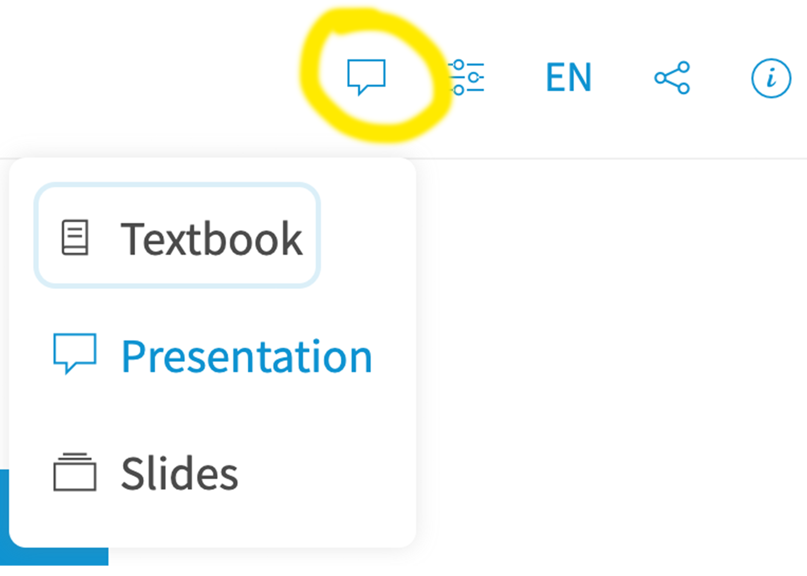
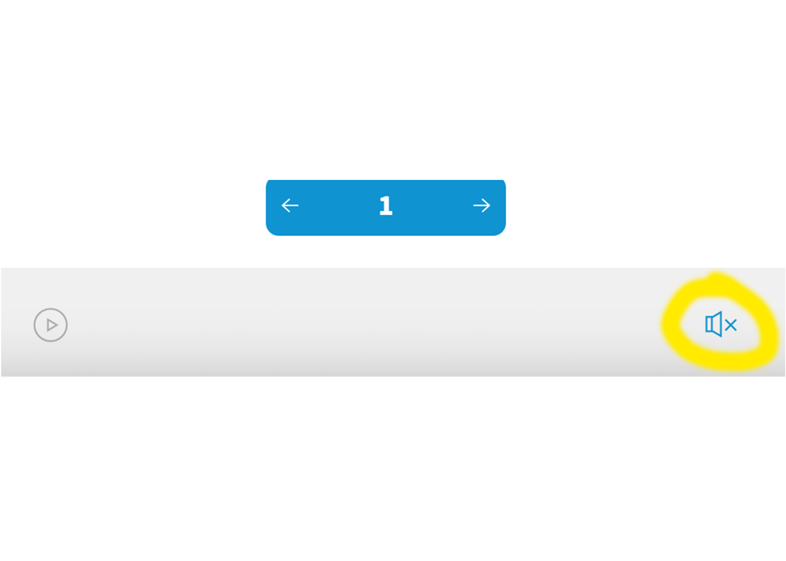

<!--
author: Meredith Lee
email: leemc@chop.edu
version: 1.0.0
current_version_description: Initial version
module_type: slides
docs_version: 3.0.0
language: en
narrator: US English Female
mode: Presentation
classroom: enable
@onload: window.LIA.settings.sound = false

title: SQL Joins

comment: Learn about SQL joins: what they accomplish, and how to write them.

long_description: Usually, data in a SQL database is organized into multiple interrelated tables.  This means you will often have to bring data together from two or more tables into a single dataset to answer your research questions.  This "join" action is accomplished using `JOIN` commands.  This module teaches types of joins, join criteria, and how to write `JOIN` code.

estimated_time_in_minutes: 60

@pre_reqs
Learners should have experience writing SQL code on single tables.  If you have successfully used a "SELECT... FROM... WHERE" SQL statement on a single table, and have at least seen "GROUP BY" commands in action, even if you would need help writing the GROUP BY code, you have enough code ability.  We also highly recommend that you understand the concepts of one-to-many data relationships and database normalization to get the most out of this module. 

If you need to develop basic SQL fluency we recommend our module [SQL Basics](https://liascript.github.io/course/?https://raw.githubusercontent.com/arcus/education_modules/main/sql_basics/sql_basics.md).  For more intermediate topics, we suggest our module [SQL Intermediate](https://liascript.github.io/course/?https://raw.githubusercontent.com/arcus/education_modules/main/sql_intermediate/sql_intermediate.md).  Finally, to learn about one-to-many data relationships and database normalization, consider our [Database Normalization](https://liascript.github.io/course/?https://raw.githubusercontent.com/arcus/education_modules/main/database_normalization/database_normalization.md) module.
@end

@learning_objectives  
After completion of this module, learners will be able to:

- Understand the parts of a JOIN
- Describe the "shapes" of SQL JOINs: inner, left, right, and full
- Explain what "join criteria" are
@end

good_first_module: false
data_domain: ehr
data_task: data_wrangling
collection: learn_to_code
coding_required: true 
coding_language: SQL
coding_level: intermediate
sequence_name: sql
previous_sequential_module: sql_intermediate
@sets_you_up_for

@end

@depends_on_knowledge_available_in
- sql_intermediate
- database_normalization
@end

@version_history
No previous versions.
@end

repo_link: [GitHub repository for these materials](https://github.com/arcus/arcus_skill_series_sql)
module_link: [SQL Joins](https://liascript.github.io/course/?https://raw.githubusercontent.com/arcus/education_modules/main/sql_joins/sql_joins.md)

import: https://raw.githubusercontent.com/arcus/education_modules/main/_module_templates/macros.md
import: https://raw.githubusercontent.com/arcus/education_modules/alasql_data_type_improvement/_module_templates/macros_sql.md


script: https://cdn.jsdelivr.net/npm/alasql@0.6.5/dist/alasql.min.js
attribute: [AlaSQL](https://alasql.org)
           by [Andrey Gershun](agershun@gmail.com)
           & [Mathias Rangel Wulff](m@rawu.dk)
           is licensed under [MIT](https://opensource.org/licenses/MIT)

script: https://cdnjs.cloudflare.com/ajax/libs/PapaParse/4.6.1/papaparse.min.js
attribute: [PapaParse](https://www.papaparse.com)
           by [Matthew Holt](https://twitter.com/mholt6)
           is licensed under [MIT](https://opensource.org/licenses/MIT)

script: https://cdnjs.cloudflare.com/ajax/libs/jquery/3.6.0/jquery.min.js
attribute: [jQuery](https://jquery.com/)
           is licensed under [OpenJS Foundation](https://openjsf.org/)

@AlaSQL.eval
<script>
//////////////////////////////////////////////////////////////////////////////////////////////////////////////////////////////
// BUILD FUNCTIONS
//////////////////////////////////////////////////////////////////////////////////////////////////////////////////////////////

function buildHtmlTable() {
  // Builds the HTML Table out of myList, and writes output to the id attribute assigned via the "@0" argument to this marco.
  var columns = addAllColumnHeaders(myList);
  for (var i = 0 ; i < myList.length ; i++) {
    var row$ = $('<tr/>');
    for (var colIndex = 0 ; colIndex < columns.length ; colIndex++) {
      var cellValue = myList[i][columns[colIndex]];
      if (cellValue == null) { cellValue = ""; }
      row$.append($('<td/>').html(cellValue).css({
      "padding-left": "1em",
      "padding-right": "1em"
      }));
    }
    $(@0).append(row$);
  }
  try { // Error Handling for no null.
    var rowCount = document.getElementById(@0.substring(1)).rows.length - 1;
  } catch(err) {
    var cnt = 0
  }
  if (rowCount > 0) {
    var complete_message = "Query Execution Complete! (See Result Set Below)..."
  } else {
    var complete_message = "No Data to Return.."
  }
  return JSON.stringify(complete_message, null, 3);
}
function addAllColumnHeaders(myList) {
  // Creates and Returns Header Row From Array Data Provided as Input.
  var columnSet = [];
  var headerTr$ = $('<tr/>');
  for (var i = 0 ; i < myList.length ; i++) {
    var rowHash = myList[i];
    for (var key in rowHash) {
      if ($.inArray(key, columnSet) == -1){
        columnSet.push(key);
        headerTr$.append($('<th/>').html(key));
      }
    }
  }
  $(@0).append(headerTr$);
  return columnSet;
}
//////////////////////////////////////////////////////////////////////////////////////////////////////////////////////////////
//
//////////////////////////////////////////////////////////////////////////////////////////////////////////////////////////////
try {
    var myinput=`@input`
    myinput=myinput.replace(/;/, ""); // remove all semi-colon
    var myStriptArray= myinput.split(';');
    var arrayLength = myStriptArray.length;
    console.clear();
    for (var i = 0; i < arrayLength; i++) {
        if((myStriptArray[i].trim()).length != 0) { // ignore blank queries.
            var myList=alasql(myStriptArray[i]);
        }
        if (myList != 1  & ((myStriptArray[i].trim()).length) != 0) { // If data is returned, format output as table.
            $(@0).html(""); // clear out existing data
            buildHtmlTable();
        } else {
            $(@0).html(""); // clear out existing data
            JSON.stringify("No Data to Return..", null, 3);
        }
    }
} catch(e) {
  let error = new LiaError(e.message, 1);
  try {
    let log = e.message.match(/.*line (\d):.*\n.*\n.*\n(.*)/);
    error.add_detail(0, e.name+": "+log[2], "error", log[1] -1 , 0);
  } catch(e) {
  }
  throw error;
}
</script>
@end

@AlaSQL.buildTable_disease
<script>
    alasql("DROP TABLE IF EXISTS disease;");
    alasql("create table disease (subject_id integer, lung_cancer boolean);");
    alasql("INSERT INTO disease VALUES ('3','TRUE');");
    alasql("INSERT INTO disease VALUES ('5','FALSE');");
    alasql("INSERT INTO disease VALUES ('8','FALSE');");
</script>
@end

@AlaSQL.buildTable_smoking
<script>
    alasql("DROP TABLE IF EXISTS smoking;");
    alasql("create table smoking (subject_id integer, smoking_pack_years integer);");
    alasql("INSERT INTO smoking VALUES ('2','10');");
    alasql("INSERT INTO smoking VALUES ('3','10');");
    alasql("INSERT INTO smoking VALUES ('4','0');");
</script>
@end


big: <b style="font-size: 1.25em;">@0</b>
center: <div style="text-align: center;">@0</div>
colorhighlight: <b style="font-size: 1.15em; color: rgba(var(--color-highlight));">@0</b>

@sql_series_slide

<div style = "text-align: center; font-weight: bold;font-size: 1.5em; color: white; background-color: rgba(var(--color-highlight));">Welcome to the Arcus Education Skill Series!</div>

<br>

<div style = "align-items: center; display: flex;">
<div style = "margin: 1rem; max-width: 30%; float:left; padding-right:4em;">
</div>
<div style = "margin: 1rem auto; max-width: 65%; float:left;">
<h3>Beyond the Spreadsheet: Understanding SQL and Relational Databases</h3> 

</div>
</div>
@end

@todays_talk
@big(@title)

After this session, learners will be able to:

@learning_objectives
@end

@about_these_slides

These slides were created with [LiaScript](https://liascript.github.io/), an open source markdown parser for writing educational content.

All of the speaker notes from today's talk are saved in the slides themselves -- try changing the view to Textbook and it will integrate the text from the notes into the slides themselves, or turn on the sound at the bottom to hear the notes read out loud as you go through. 

<div style = "align-items: center; display: flex;">
<div style = "margin-left: 10%; max-width: 25%; float:left; border-style: solid; border-color: rgba(var(--color-highlight));">

</div>
<div style = "margin-right: 10%; max-width: 25%; float:right; border-style: solid; border-color: rgba(var(--color-highlight));">

</div>
</div>

The content from this talk is also available as an online self-paced tutorial: @module_link 

For all of the files and information from this talk, go to our @repo_link 

@end

@teams_polls 

@big(Today's presentation will include interactive content!)

The best way to learn is to practice!

When we reach 💫 **Your Turn** sections, you'll have a chance to write or edit some SQL code of your own. There will also be opportunities to ask questions, and there will be some polls and other prompts in the chat to respond to.

@end
-->


# SQL Joins
@sql_series_slide

--{{0}}--
Welcome! 
I'm Meredith Lee, and I use she/her pronouns. 
I'm a data instructor on the Arcus Education team in DBHi. 
Today's talk is the final piece of our five-part series on sequel, or S-Q-L.  
Today's webinar will be recorded, so please leave your cameras and mics turned off until the question time at the end.
If you do have questions that come up during the talk, feel free to put them in the chat. 
So with that, let's get started!

## Today's talk

@todays_talk 

--{{0}}--
Today, we'll be learning how to combine data from two or more interrelated tables into one dataset using the JOIN command. This is a hands-on webinar -- we'll be writing some real SQL code! If that sounds daunting, don't worry; I'll provide plenty of scaffolding, and we'll work through things together. 

--{{0}}--
In the last webinar in this series my colleague Elizabeth Drellich taught you how to write intermediate-level SQL queries using CASE, LIKE, and GROUP BY, as well as how to use some aggregate functions.  Today, we'll first quickly review those commands, and then we'll learn how to combine data from multiple tables using the JOIN command. 

## Thank you!

<div class = "gratitude">
<b style="color: rgb(var(--color-highlight));">Thank you!</b><br>

Material for this talk is based closely on the DART module @module_link, written by Joy Payton.

</div>

--{{0}}--
Many thanks to Joy for her work developing this excellent content!

Our webinar today will **not** cover all of the topics in the module, as we simply won't have time, so I suggest you check it out after our session. 

## Learn by doing

@teams_polls

--{{0}}--
We're firm believers that the best way to learn is to practice! As I mentioned before, we will have opportunities to practice writing our own SQL code today using tables containing fake medical records. There will also be some short quizzes to help solidify your understanding as we go.

--{{0}}--
With that being said, lets get started!

## SQL: A Quick Review

**SQL** (**S**tructured **Q**uery **L**anguage) has, for more than four decades, been used to interact with **relational databases**.

A relational database is a data storage solution that stores data tables, which are comprised of columns (also called 'fields') and rows.

--{{0}}--
First, let's quickly review some key concepts from our previous four sessions. 

"Sequel", or S-Q-L (either pronunciation is fine) stands for **Structured Query Language**. SQL a specialized programming language that is used to interact with Relational Databases. 

--{{0}}--
Relational databases consist of many different data tables. Today we will be working with multiple tables that are stored in a single relational database. 

{{1}}
*****
<h4> What SQL is for: </h4>
isolating and combining just the data you're interested in, such as:

 * extracting columns you're interested in
 * filtering to just the data that meets specific criteria
*****
--{{1}}--
SQL is great at working with rectangular data, data that is stored in tables with rows and columns / fields. 

{{2}}
*****
<h4> What SQL is **NOT** good for: </h4>

* fine tuned statistical, linguistic, or data visualization needs
*****
--{{2}}--
However, it's not great for fine-tuned statistical, linguistic, or data visualization purposes.  SQL is therefore a tool that is often partnered with other tools like R or Python, which are better suited for work like statistical analysis. We will, however, see some of the ways that SQL can generate simple summary statistics today.

### Flavors of SQL

--{{0}}--
SQL is technically not just one thing -- there are a variety of different implementations. Although all SQL implementations have a similar structure, and the same basic syntax, each different SQL database product often has its own minor variations in dialect.

--{{0}}--
Colloquially people often refer to the different SQL dialects as different "flavors" of SQL.

Some popular "flavors" of SQL:

* [**MySQL**](https://www.mysql.com/) (open source)
* [**SQLite**](https://www.sqlite.org) (open source)
* [**PostgreSQL**](https://www.postgresql.org/) (open source)
* [**Oracle**](https://www.oracle.com/database/technologies/appdev/sql.html) (proprietary)
* [**BigQuery**](https://cloud.google.com/bigquery/docs/reference/standard-sql/query-syntax) (proprietary)


--{{0}}--
The most common difference between different SQL "flavors" are the availability of different functions that users can use for data manipulation, as well as the types of error messages that will be returned to the user when running code with syntax issues. There may be a few times during this webinar when I will point out that the flavor of SQL we are using today is impacting the outputs we get. 

--{{0}}--
Because different flavors can have different outputs, knowing the specific flavor or dialect of SQL your database uses is especially useful when first getting started writing queries and troubleshooting errors. Whenever you search for documentation online or are troubleshooting, you'll want to be sure to include the name of the "flavor" you're working with in your search terms. 

{{1}}
*****
<h3>Flavor of the Day: [**AlaSQL**](https://alasql.org/) </h3> 
*****

--{{1}}-- 
In the hands-on portion of this webinar, we'll be using a form of SQL that actually runs in your web browser as you look at these pages.  This lightweight SQL engine is called "AlaSQL".  We pre-populated some tables for you to experiment with in this presentation.  These tables are filled with fabricated data meant to look a little like an electronic health record (EHR).  Rest assured that this data was completely invented, although it might look realistic!

### SELECT, FROM, WHERE

`SELECT`, as its name suggests, is used to select the particular columns you want, and `FROM` is used to specify the table or tables those columns are from. 

--{{0}}--
Before we learn any new SQL commands, let's do a quick review of the commands SELECT, FROM, and WHERE that we learned about last month.

--{{0}}--
To select only the columns (or fields) you want, you can use a `SELECT` statement. `SELECT` specifies the columns you're interested in, and `FROM` specifies the table (or tables) those columns are from.

{{0}}
*****
```sql
SELECT 
  patients.id
  ,patients.address
  ,patients.city
  ,patients.county
  ,patients.state
FROM alasql.patients
```
@AlaSQL.eval("#dataTable_select_list_fields")

<details open>

<summary>**Results of Query (click to collapse or expand this section)**</summary>

<table id="dataTable_select_list_fields" border="1"></table>

</details><br/><br/>

<div style = "display:none;">

@AlaSQL.buildTable_patients

</div>

*****

--{{0}}--
Here, we have selected "id", "address", "city", "county", and "state", which is a subset of the columns it the patient table.

--{{0}}--
As a reminder, we recommend using dot notation and comma-first style to list the specific fields you want to see.

--{{1}}--
The **WHERE clause**, using the `WHERE` keyword, is the section of your query used to specify any "filtering logic" that should be applied to your query before returning any output.  It's optional but very useful.

--{{1}}-- 
As an example, here's how you'd filter the output to only include records for a specific county.

{{1}}
*****
Use `WHERE` to return only rows for which a conditional statement is true:

```sql
SELECT 
  patients.id
  ,patients.address
  ,patients.city
  ,patients.county
  ,patients.state
FROM alasql.patients
WHERE
	patients.county = "Suffolk County";
```
@AlaSQL.eval("#dataTable_where")

<details open>

<summary>**Results of Query (click to collapse or expand this section)**</summary>

<table id="dataTable_where" border="1"></table>

</details><br/><br/>

<div style = "display:none;">

@AlaSQL.buildTable_patients

</div>

*****

--{{1}}--
In the previous webinar in this series, we learned other keywords such as `DISTINCT`, `CASE`, `LIKE`, `GROUP BY`, and `HAVING`. We won't need to use those today, and so we're not going to review them. If you need a review of those keywords, or any other topic we've previously covered, please see our previous webinar recordings. 

## Overview of Joins

Most SQL queries require something more complex than referencing data from a single table. Using the `JOIN` command, data from two SQL tables can be joined together. 

This is what a SQL join looks like: 

```sql
SELECT
  disease.subject_id
  ,disease.lung_cancer
  ,smoking.smoking_pack_years
FROM disease JOIN smoking
ON disease.subject_id = smoking.subject_id;
```

--{{0}}--
Up to now, we have be working with data from one table at a time. However, often the questions you want to answer will require referencing more than one table-- this is where SQL "join" functionality and the `JOIN` keyword come into play. 

### Joins: Why?

--{{0}}--
Let's consider the case where you have data about a multi-site study's research subjects. One table holds depression scores for subjects and a different table holds subject addresses.  Your hypothesis is that people who live in certain zip codes have higher rates of depression.  

--{{0}}--
To see if your hypothesis has evidence to back it, you need to combine data, taking the subject ID and depression score from one table, and the subject ID and zip code from another table, and combining them, so that you get matching information in the same table row.

Maybe your source tables look something like the tables below:

**Table 1: depression\_scale**

<!-- data-type="none" class="tight-table" style="font-size:80%"-->
| subj\_id  | date  | dep\_q1  | dep\_q2   | dep\_q3  | dep\_q4  | dep\_total   |
| :--------- | :--------- | :--------- | :--------- | :--------- | :--------- | :--------- |
| 11234   | 2021-05-15   | 3    | 3  | 2    | 4    | 12    |
| 86234   | 2021-06-01   | 4    | 4  | 3    | 4    | 15    |
| 32660   | 2021-06-10   | 1    | 1  | 2    | 1    | 5   |
| 86234   | 2022-01-13   | 2    | 2  | 1    | 3    | 8    |
| 41356   | 2022-02-10   | 1    | 3  | 2    | 3    | 10   |

**Table 2: subject\_address**

<!-- data-type="none" class="tight-table" style="font-size:80%"-->
| subj\_id  | street\_address  | city  | state   | zip  | date\_start  | date\_end   |
| :--------- | :--------- | :--------- | :--------- | :--------- | :--------- | :--------- |
| 11234   | 123 Main Street   | Smithtown    | PA  | 19000    | 2022-01-01   | `NULL`    |
| 11234   | 123 Oak Lane   | Old Towne    | PA  | 18000   | 2000-01-01    | 2021-12-31    |
| 93452   | 123 Green Blvd  | Kirby    | TN  | 37000    | 2020-05-01    | `NULL`   |


What you want to eventually end up with will be a single table of results that might only have three columns: "subj\_id", "dep\_total", and "zip".  That way you can look at the relationship between depression inventory scale and zip code.

### Joins: How? 

There are two basic pieces of information you need to know to write successful joins:

{{1}}
*****
**Type of join**: What type of join do you want to use? The type of join shows up in SQL in a `FROM` statement, and will look something like:

`FROM [table_1] [optional keyword] JOIN [table_2]`
*****

--{{1}}--
Let's say you have some students with math grades and some students with language grades.  Some students are in only the math table, some are only in the language table, and some are in both.  What part of the overlapping data do you want?  Only the data on students with both kinds of grades?  Or some other, larger set of student data? The answer to this question will determine what type of join you choose. 

{{2}}
*****
**Join criteria**: What criteria would you like your join evaluated against?  In other words, how are you matching rows from one table to rows from another table?

The join criteria shows up in SQL in an `ON` or `USING` statement, and will look something like:

`ON [table_1.field_name] = [table_2.field_name]` 

OR

`USING(field_name)` (this method is less frequently used)

*****

--{{2}}--
When thinking about join criteria, we want to know what constitutes a "match" of data from one table to data from another. If you're joining tables that hold student grades, for example, you probably want to only join data together where the student ID matches.

--{{2}}--
It can be surprisingly tricky to figure out what makes data "match" or "go together" in your join criteria. If we take a look at the tables on the previous slide, what data should be considered "matching" between the "depression\_scale" table and the "subject\_address" table? Write your answer in the chat.

--{{2}}--
Was the answer as simple as just matching on the subject id ("subj\_id")? 

### Combining Join type and criteria

You'll combine join type and join criteria by using both the `FROM` component and the `ON` or `USING` component.  Your SQL query might include lines that look something like this: 

```sql
SELECT 
  table_1.*    -- all the fields from table_1
  ,table_2.icd9     -- and a couple of fields 
  ,table_2.dx_date  -- we want from table_2 
FROM table_1 LEFT JOIN table_2
ON table_1.pat_id = table_2.pat_id;
```

--{{0}}--
This is the basic structure of a SQL join, including the type of join and the criteria we're using to match data across table 1 and table 2.  For the rest of this module we'll first talk about join types, then join criteria, and then we'll finish up with more examples to help you understand how these two elements of a join work together to give you the results you care about.

## Join Types

--{{0}}--
Let's consider the gradebook example we mentioned earlier. We might have two tables, one called "math\_grades" and one called "language\_grades".  Some students appear in "math\_grades", some in "language\_grades", and some students have rows in both tables. 

Let's consider the gradebook example we mentioned earlier.

**math\_grades**

<!-- data-type="none" class="tight-table"-->
| student\_id  | math\_grade | semester |
| :--------- | :--------- | :------ |
| 11  | A | Jan-May 2023 |
| 12  | B | Jan-May 2023 |
| 13  | A | Sep-Dec 2022 |

**language\_grades**

<!-- data-type="none" class="tight-table"-->
| student\_id  | language\_grade | semester |
| :--------- | :--------- | :------ |
| 11 | C | Sep-Dec 2022 |
| 14 | B | Jan-May 2023 |
 
--{{1}}--
This can be represented by a Venn diagram where the left circle represents a group of students who appear in the math\_grades table and the right circle represents the group of students who appear in the language\_grades table. There's some overlap of these two circles, representing the subset of students who appear in both tables. There are 4 basic join types we'll talk about now.

{{1}}
*****

We can visualize these groups of students using a Venn diagram with students in "math\_grades" on the left and students in "language\_grades" on the right.  

<lia-keep>

<style>
#infographic {
 width: 40em;
 height: 24em;
  margin: 1em auto;
  padding: 1em;
  position: relative;
}

.circle {
  border: .2em solid #000;
  border-radius: 50%;
  width: 24em;
  height: 24em;
  text-align: center;
  vertical-align: center;
  position: absolute;
}

.circle p {
  height: 24em;
  width: 14em;
  display: table-cell;
  vertical-align: middle;
}

#c1 {
  top: 0;
  left: 0;
  background-color: rgba(255,0,0,.25);
}

#c2 {
  top: 0;
  left: 12em;
  background-color: rgba(0,255,0,.25);
}

#c1 p{
  padding-right: 2em;
}
#c2 p {
    padding-left: 12em;
    width: 22em;
}


#j12 {
    position: absolute;
    left: 12em;
    width: 11em;
    height: 22em;
    padding: 1em;
    text-align: center;
}

#j12 p {
  height: 22em;
  width: 10em;
  display: table-cell;
  vertical-align: middle;
}
</style>
<div id="infographic">
  <div id="c1" class="circle">
    <p>Left Side: <br/>Only Math Grades</p>
  </div>

  <div id="c2" class="circle">
    <p>Right Side: <br/>Only Language Grades</p>
  </div>

  <div id="j12" class="joined">
    <p>
      Overlap: <br/>Both Math and Language Grades
    </p>
  </div>
</div>

</lia-keep>

 Depending on your purposes, you might want any one of several types of joins, each with its own SQL keyword combination. There are 4 basic join types that we'll talk about today:
*****

{{2}}
**`INNER JOIN`**.   

{{3}}
**`LEFT JOIN`**.   

{{4}}
**`RIGHT JOIN`**.  

{{5}}
**`FULL JOIN`**.   

### `INNER JOIN`

Here, let's consider the left table to be **math\_grades** and the right table to be **language\_grades**.

 

--{{1}}--
An `INNER JOIN` (and this is the default behavior of `JOIN` without any modifying words) finds matching grade data falling in the "Both Math and Language Grades" overlap section.  This is often the data you want to capture. If you're conducting research on the correlation between math and language grades, this is the join you want.  If a student lacks one or the other grade, their data isn't useful to you, so you don't want it. The result of an inner join will be a table that only has rows of data for students who appear in both tables.  If a student is missing in one or the other table of grades, that student won't appear in your result set.

{{1}}
An `INNER JOIN`, finds the data falling in the "Both Math and Language Grades" overlap section (highlighted in blue above). This is the most frequently used join type, and will result in a table with only the students who have both math and language grades. 

{{2}}
*****

An `INNER JOIN` shows up in code like this:

```sql
...
FROM math_grades INNER JOIN language_grades
...
```

or

```sql
...
FROM math_grades JOIN language_grades
...
```
*****

{{3}}
******
<div class = "important">
<b style="color: rgb(var(--color-highlight));">Important note</b><br>

Note that the word `JOIN` by itself means `INNER JOIN`.  Make sure you remember that the default kind of join, without any keywords, is an inner join, which may or may not be what you want!
</div>
*****

### `LEFT JOIN`

--{{0}}--
Again, let's consider the left table to be **math\_grades** and the right table to be **language\_grades**.
A `LEFT JOIN` (or a `LEFT OUTER JOIN` as you'll sometimes see it) finds unmatched data in "Only Math Grades" -- that's the "outer" part on the left -- and also finds matching data in "Both Math and Language Grades" -- the overlap section.  It would exclude student data in the "Only Language Grades" section (which is on the right). Maybe you want this data because as the chair of the mathematics department, you want to see what students are strongest, in math, and also in language if known, in order to select who to award a math prize to.  Perhaps you'll use language grades as a tie-breaker, for example?

 


--{{1}}--
The result of a left join is a table which contains rows of data for students who only have math grades (and therefore appear in the left table) as well as rows of data for students who have math and language grades (and therefore appear in both tables), but no rows of data for students who only have language grades. When there is no matching data from the language table to join to the data from the math table, because the students don't have language grades, these cells in the table are empty, or `NULL`. 

{{1}}
*****

The result of a left join will be a table that has:

* Rows of data for students who appear in the left table only
* Rows of data for students who appear in both tables.
* `NULL` values (empty cells) when there's no matching data from the right table to join to the students who only appear in the left table
*****

--{{2}}--
A `LEFT JOIN` shows up in code like this.  Note that one table is listed first, and is therefore on the left, and the other table is listed second, and is therefore on the right (because English is written left to right). Note that unlike an inner join, you'll always need to specify that you are using a left join (though the "outer" need not be specified, depending on your preference).

{{2}}
*****

A `LEFT JOIN` shows up in code like this:

```sql
...
FROM math_grades LEFT JOIN language_grades
...
```

or

```sql
...
FROM math_grades LEFT OUTER JOIN language_grades
...
```
*****

### `RIGHT JOIN`

--{{0}}--
A `RIGHT JOIN` (or a `RIGHT OUTER JOIN`) finds unmatched data in "Only Language Grades" -- that's the "outer" part on the right of the Venn diagram -- and also finds matching data in "Both Math and Language Grades" -- the overlap section.  It would exclude student data in the "Only Math Grades" section (which is on the left). Maybe you want this data to create a graph of language grade distribution, and want to enrich it with some statistics about math grades where available, but it doesn't matter if some students lack math grades. 

 

--{{1}}--
The result of a right join is a table which contains rows of data for students who only have language grades (and therefore appear in the right table) as well as rows of data for students who have language and math grades (and therefore appear in both tables), but no rows of data for students who only have math grades. When there is no matching data from the math table to join to the data from the language table, because the students don't have math grades, these cells in the table are empty, or `NULL`. 

{{1}}
*****

**Results:**
The result of a right join will be a table that has:

* Rows of data for students who appear in the right table only
* Rows of data for students who appear in both tables. 
* `NULL` values (empty cells) when there's no matching data from the left table to join to the students who only appear in the right table.
*****

--{{2}}--
A `RIGHT JOIN` shows up in code like this.  Recall that "left" and "right" refer to the order in which the table names are typed in the `FROM` statement, and "math grades" is our left table and "language grades" is our right table.

{{2}}
*****

A `RIGHT JOIN` shows up in code like this:

```sql
...
FROM math_grades RIGHT JOIN language_grades
...
```

or

```sql
...
FROM math_grades RIGHT OUTER JOIN language_grades
...
```
*****

--{{3}}--
You might not see a lot of right joins in code "in the wild", and that's because many people who write SQL code simply prefer to use all left joins! It's simple preference, it's not correct or incorrect practice. Because "right" and "left" simply refer to the order in which the tables are written in the FROM statement, you can re-write a right join into a left join by switching the order of the tables in the FROM statement. That way, you choose whether you use a right or left join (and this is often a left join by convention.)

{{3}}
*****

<div class = "options">
<b style="color: rgb(var(--color-highlight));">Another option</b><br>

Because "right" and "left" in the join types simply refers to the order in which you write the tables in the `FROM` statement, it's easy to turn a right join into a left join:<br/><br/>

<code>
FROM math\_grades RIGHT JOIN language\_grades
</code>
<br/><br/>
Can be rewritten as: 
<br/><br/>
<code>
FROM language\_grades LEFT JOIN math\_grades
</code>
<br/><br/>

</div>
*****

### `FULL JOIN`

--{{0}}--
A `FULL JOIN` (or sometimes you'll see `FULL OUTER JOIN`) will consider all the data -- all of the outer, unmatched data on the right (language\_grades) and left (math\_grades) tables, as well as the inner overlapping data which has matching data from both tables. This kind of join is important if you want to create a grade book that shows student grades for each student, including their math grades and/or their language grades.  

 

--{{1}}--
The result of a full join will be a table that has rows of data for students that have only math grades (and therefore appear only in the left table), students that have only language grades (and therefore appear only in the right table), and student that have both grades (and therefore appear in both tables). When there's no matching data from the one of the tables to join to the data you included from the other table, `NULL` values (empty cells) are added. When there is no matching data from one table to join to the data from the other table, because the student doesn't have grades for both subjects, these cells in the table are empty, or `NULL`. 

{{1}}
*****
**Results:**
The result of a full join will be a table that has:

* Rows of data for students who appear in the left table only
* Rows of data for students who appear in both tables
* Rows of data for students who appear in the right table only.
* `NULL` values (empty cells) when there's no matching data from the one of the tables to join to the data you included from the other table.
*****

--{{2}}--
A `FULL JOIN` shows up in code like this. You can specify `FULL OUTER JOIN`, but just `FULL JOIN` means the same thing; which you choose will come down to preference. 

{{2}}
*****

A `FULL JOIN` shows up in code like this:

```sql
...
FROM math_grades FULL JOIN language_grades
...
```

or

```sql
...
FROM math_grades FULL OUTER JOIN language_grades
...
```
*****

### 💫 **Your Turn 1: Join Types**

Consider the scenario of a table of math grades for 9th grade students and a table of language grades for 9th grade students.  Some 9th graders appear in both tables, but some appear only in one of them.  Fatima appears in the math\_grades table, but not in the language\_grades table.  When you perform a full outer join on these two tables, what will happen to Fatima's data in the resulting joined table?

[( )] Her data will not appear, since she's not represented in both tables.
[(X)] Her math grade will appear and she'll have a blank for her language grade.
[( )] The join command will fail, because a full join can only take place on fully overlapped tables.
[( )] The join command will fail because there's no such type of join as a full outer join.
****

<div class = "answer">

A full outer join is indeed a type of join, and it can take place on any two tables, whether they have a full or partial overlap or even no overlap at all.  In this example case, Fatima's data will appear in the results table, because regardless of whether the math\_grades table was written on the left or the right, a full outer join includes both the left and right tables' data.  We know her math grade, so that will appear, but since there's no matching data for Fatima in the language\_grades table, she'll have empty cells with `NULL` values for any columns that come from the language\_grades table.

</div>
****

## Join Criteria

--{{0}}--
The second component of a SQL Join, regardless of the join type, is the set of conditions  by which rows from two different tables are said to "match", called join criteria. Join criteria will be some sort of relationship statement referencing data that occurs in both tables you want to join. This relationship statement will be valuated to TRUE or FALSE when your join is executed. 

What makes a row from the math\_grades table match up with a row from the language\_grades table?

Let's look at some examples of join criteria:

--{{1}}--
As a reminder, SQL is a **relational database**, so it's not surprising that we talk about data relationships here. If for example you had the two tables "depression scale" and "subject address", you might want to match on the common field "subject ID". 

{{1}}
Join the rows from "depression\_scale" with rows from "subject\_address" **... but only if the subject ID field matches**

--{{2}}--
Similarly, if you had the two tables "items" and "orders", you might want a subset of data, but ony where the item ID is the same. 

{{2}}
Join the rows from "items" with the rows from "orders" **... but only if the item ID field matches**

--{{3}}--
You can also have more than one condition to match on-- in this case, perhaps we want not only to match the student IDs between the two tables, but also the semester. 

{{3}}
Join the rows from "biology\_grades" with the rows from "psychology\_grades" **... but only if the student ID is the same and the semester is the same**

--{{3}}--
When the conditions in your join criteria evaluate as TRUE for a row then a join will be performed for those rows, and when the join criteria are evaluated as FALSE no join for those rows will take place. Often, the relationship is equality, such as in the examples above -- you're looking for a perfect match between your two tables (though this is not always the case, as we'll see later).


### Examples of Equality

--{{0}}--
Equality is the most frequently used condition for joins, when you are looking for "matches" between two tables. We've already seen a few general examples, but now let's look at some tables and how we might express our criteria in SQL. 

Equality is the most frequently used condition for joins. 

--{{1}}--
Do you have subject identifiers or student ID numbers in two different tables?  This shared information can be used to connect (join) data from these tables, based on the identifier being equal.  

--{{1}}--
For example, if the subject ID matches, a row from table A and a row from table B will be joined.  If the subject ID doesn't match, these rows won't be joined.  Maybe we're trying to match lung cancer occurrence and smoking exposure in the same row:

{{1}}
*****

**Example 1**

**disease**

<!-- data-type="none" class="tight-table"-->
| subject\_id  | lung\_cancer |
| :--------- | :--------- | 
| 3  | TRUE |
| 5 | FALSE  |
| 8  | FALSE |

**smoking**

<!-- data-type="none" class="tight-table"-->
| subject\_id  | smoking\_pack\_years |
| :--------- | :--------- | 
| 2  | 10 |
| 3 | 10  |
| 4  | 0 |


In code, we can write this two ways:

```sql
...
ON disease.subject_id = smoking.subject_id
```

OR 


```sql
...
USING(subject_id)
```
*****

--{{1}}--
In this case, we're comparing the equality of two fields that **have the same name**, so we could also use **USING**.  This special word only applies when you're looking for a perfect match between fields that have matching names, too.  It's okay if you never use `USING` and prefer to always stick with `ON`, which is more multi-purpose. 

--{{1}}--
With either of the above code snippets (`ON` or `USING`): subject 3 from disease **matches** with subject 3 from smoking, subject 5 from disease **doesn't match** with anyone in smoking, subject 8 from disease **doesn't match** with anyone from smoking, subject 2 from smoking **doesn't match** with anyone from disease, and subject 4 from smoking **doesn't match** with anyone from disease 

--{{2}}--
Sometimes the data that appears in the two tables has the same field name, as we just saw, but sometimes the data might be stored under different names. Here is an example in which the "same" data, "semester" in "math grades" and "term" in "language grades", is labeled differently between the two tables. SQL can handle this.

{{2}}
*****

**Example 2**

**math\_grades**

<!-- data-type="none" class="tight-table"-->
| student\_id  | math\_grade | semester |
| :--------- | :--------- | :------ |
| 11  | A | Jan-May 2023 |


**language\_grades**

<!-- data-type="none" class="tight-table"-->
| student\_id  | language\_grade | term |
| :--------- | :--------- | :------ |
| 11 | C | Sep-Dec 2022 |
| 14 | B | Jan-May 2023 |

So you might see something like:

```sql
...
ON math_grades.semester = language_grades.term
```
*****

--{{2}}--
In this example, the A grade for Jan-May 2023 from math\_grades **matches** with the B grade for Jan-May 2023 in language\_grades (even though the student\_id doesn't match!), and the C grade for Sep-Dec 2022 in language\_grades **does not match** with any row in math\_grades. 

--{{2}}--
This also highlights the importance of documenting your data so you can tell which fields hold which data in order to use them properly for joins!  If `semester` and `term` are  different things, not just the same thing with two different names, the result of your join will be disappointing. This also shows that figuring out your join criteria requires close attention: we probably don't mean to match student 11's math grades with student 14's language grades!

### Non-Equality and More

--{{0}}--
Sometimes you don't need equality as your condition. Let's look again at our example from our multi-site mental health research, and let's say we want to associate a particular depression score with a particular address **only if the depression inventory was given between the start and end dates of residency at that address**.

**Table 1: depression\_scale**

<!-- data-type="none" class="tight-table" style="font-size:80%"-->
| subj\_id  | date  | dep\_q1  | dep\_q2   | dep\_q3  | dep\_q4  | dep\_total   |
| :--------- | :--------- | :--------- | :--------- | :--------- | :--------- | :--------- |
| 11234   | 2021-05-15   | 3    | 3  | 2    | 4    | 12    |
| 86234   | 2021-06-01   | 4    | 4  | 3    | 4    | 15    |
| 32660   | 2021-06-10   | 1    | 1  | 2    | 1    | 5   |
| 86234   | 2022-01-13   | 2    | 2  | 1    | 3    | 8    |
| 41356   | 2022-02-10   | 1    | 3  | 2    | 3    | 10   |

**Table 2: subject\_address**

<!-- data-type="none" class="tight-table" style="font-size:80%"-->
| subj\_id  | street\_address  | city  | state   | zip  | date\_start  | date\_end   |
| :--------- | :--------- | :--------- | :--------- | :--------- | :--------- | :--------- |
| 11234   | 123 Main Street   | Smithtown    | PA  | 19000    | 2022-01-01   | `NULL`    |
| 11234   | 123 Oak Lane   | Old Towne    | PA  | 18000   | 2000-01-01    | 2021-12-31    |
| 93452   | 123 Green Blvd  | Kirby    | TN  | 37000    | 2020-05-01    | `NULL`   |

```sql
...
ON depression_scale.date BETWEEN 
   subject_address.date_start AND 
   subject_address.date_end
```

### Multiple conditions

--{{0}}--
Of course, in the example of the depression inventory, we'd also want to make sure that there was a match on subject identifier (you don't want to match Lakshmi's depression score with Larry's address, just because the dates worked!).  You can combine conditions too.  Here, we want to look for an exact match on subject ID and a date match that's between the correct dates.

```sql
...
ON depression_scale.subj_id = subject_address.subj_id AND
   depression_scale.date BETWEEN 
      subject_address.date_start AND 
      subject_address.date_end
```

### Getting More Complicated

--{{0}}--
Let's keep thinking about our depression inventories and our goal of matching depression scores to addresses in our study. What if some addresses don't have end dates?  This could be because the subject is currently still living there. We can see in our data that there are some addresses with `NULL` end dates, so this is something we should account for.

--{{0}}--
You can create arbitrarily complex **boolean logic** (or **boolean algebra**), using AND, OR, NOT, and parentheses as needed.  Much as in math, there's an order of operations in this kind of logic, and you might need several sets of parentheses to make sure you're applying the conditions correctly.  For example, see below.  We've added comments to help illustrate the logic.

```sql
...
ON depression_scale.subj_id = subject_address.subj_id AND 
-- subject ID must match... AND...

-- either:
   ((depression_scale.date BETWEEN          
      subject_address.date_start AND 
      subject_address.date_end) OR
-- the depression date is between a start and end, OR...

   (depression_scale.date > subject_address.date_start AND 
   subject_address.date_end IS NULL))                 
-- the depression date is after the start date,
-- and there's no end date.
```

**depression\_scale**

<!-- data-type="none" class="tight-table" style="font-size:80%"-->
| subj\_id  | date  | dep\_q1  | dep\_q2   | dep\_q3  | dep\_q4  | dep\_total   |
| :--------- | :--------- | :--------- | :--------- | :--------- | :--------- | :--------- |
| 11234   | 2021-05-15   | 3    | 3  | 2    | 4    | 12    |
| 86234   | 2021-06-01   | 4    | 4  | 3    | 4    | 15    |
| 32660   | 2021-06-10   | 1    | 1  | 2    | 1    | 5   |
| 86234   | 2022-01-13   | 2    | 2  | 1    | 3    | 8    |
| 41356   | 2022-02-10   | 1    | 3  | 2    | 3    | 10   |

**subject\_address**

<!-- data-type="none" class="tight-table" style="font-size:80%"-->
| subj\_id  | street\_address  | city  | state   | zip  | date\_start  | date\_end   |
| :--------- | :--------- | :--------- | :--------- | :--------- | :--------- | :--------- |
| 11234   | 123 Main Street   | Smithtown    | PA  | 19000    | 2022-01-01   | `NULL`    |
| 11234   | 123 Oak Lane   | Old Towne    | PA  | 18000   | 2000-01-01    | 2021-12-31    |
| 93452   | 123 Green Blvd  | Kirby    | TN  | 37000    | 2020-05-01    | `NULL`   |

--{{0}}--
With this most recent join criteria: the depression score (dep\_total) for subject 11234, measured on 2021-05-15, **matches** with the address 123 Oak Lane for the same subject and time period, the depression score (dep\_total) for subject 11234, measured on 2021-05-15, will **not match** with the address 123 Main Street for the same subject, because the time period doesn't match, the other rows in the depression\_scale **don't match** with any rows in the subject\_address table, and the first and third rows of the subject\_address table **don't match** with any rows in the depression\_scale table. 

### 💫 **Your Turn 2: Join Criteria**

True or False: a matching ID (like student\_id or patient\_id) is generally sufficient as a join criterion.

[( )] True
[(X)] False
****
<div class = "answer">

Often, a matching identifier is part of what makes up good join criteria, but it may not be sufficient on its own.  For example, consider trying to link patient diagnoses with medication orders.  Patients can appear dozens or hundreds of times across decades, so to correctly link diagnoses with medications, it's not sufficient to rely just on patient id.  You might need to use an "encounter id", a date range, or another join criteria to make sure you're matching data that really belongs together (instead of joining Mary's diagnosis of diaper rash when she was 3 months old to her prescription of Ritalin at age 9).

</div>
****

## Combining It All

--{{0}}--
Now, we'll get the chance to combine the two parts of SQL joins to craft some queries. We'll use `FROM` statements to describe the type of join and an `ON` statement to describe the join criteria. Don't worry, we'll add plenty of scaffolding in the beginning, and slowly work up to crafting an entire SQL query. 

Now we'll practice crafting some SQL queries by combining join type and join criteria. 

To create a SQL join, we'll need:

* A `FROM` statement, describing the type of join, and 
* A `ON` statement, describing the join criteria

--{{0}}--
Importantly, we will only present a few examples.  There are many combinations we could consider, at all levels of complexity, and we won't have time to cover all of the possibilities. Instead of being exhaustive, we've concentrated on the most frequent use case you'll encounter over and over: equality.  We'll go over each join type (inner, left, right, and full) on a simple equality matching a single field from each table.

### 💫 **Your Turn 3: `INNER JOIN` and Equality Condition**

--{{0}}--
To understand what an `INNER JOIN` with equality looks and acts like practically, let's perform an inner join on these two tables.  To do this, we have to combine join criteria (subject\_id matching) with join type (inner). 

You are studying the link between lung cancer and smoking behavior. Let's perform an **inner join** on these two tables, matching on `subject_id`. (Remember, with an inner join, we only want subjects for which data are present in **both** tables). 

**disease**

<!-- data-type="none" class="tight-table"-->
| subject\_id  | lung\_cancer |
| :--------- | :--------- | 
| 3  | TRUE |
| 5 | FALSE  |
| 8  | FALSE |

**smoking**

<!-- data-type="none" class="tight-table"-->
| subject\_id  | smoking\_pack\_years |
| :--------- | :--------- | 
| 2  | 10 |
| 3 | 10  |
| 4  | 0 |


--{{0}}--
The join criteria is already written, but we need to add the join type. You'll need two table names separated by some kind of `JOIN` command.  For now, leave the `ON` code unchanged. Think about what rows you expect to see in your result set before you run any code. When you want to see the results of your code, click on the "play" button below the code block. Return here when you're done and we'll do through the answer together. 

```sql
SELECT *
FROM ...
ON disease.subject_id = smoking.subject_id;
```
@AlaSQL.eval("#dataTable19a")

<lia-keep><table id="dataTable19a" border="1"></table><br></lia-keep>

<div style = "display:none;">

@AlaSQL.buildTable_disease

@AlaSQL.buildTable_smoking

</div>

<details>
<summary style = "margin-bottom: 1rem;">*Going through these slides on your own? Click here to reveal an answer once you're done!*</summary>

Try:

```sql
SELECT *
FROM disease JOIN smoking
ON disease.subject_id = smoking.subject_id;
```

</details>


### 💫 **Your Turn 4: `LEFT JOIN` and Equality Condition**

--{{0}}--
Now's let's practice a left join. This time, you'll need to add both the `FROM` and the `ON` code sections to the SQL code. For now, use `ON`, and don't try `USING` just yet.

Now let's try a `LEFT JOIN`. We'll make **disease** the left table and **smoking** the right table, still matching on `subject_id`. 

**disease**

<!-- data-type="none" class="tight-table"-->
| subject\_id  | lung\_cancer |
| :--------- | :--------- | 
| 3  | TRUE |
| 5 | FALSE  |
| 8  | FALSE |

**smoking**

<!-- data-type="none" class="tight-table"-->
| subject\_id  | smoking\_pack\_years |
| :--------- | :--------- | 
| 2  | 10 |
| 3 | 10  |
| 4  | 0 |


```sql
SELECT *
FROM ...
ON ...
```
@AlaSQL.eval("#dataTable20a")

<lia-keep><table id="dataTable20a" border="1"></table><br></lia-keep>

<div style = "display:none;">

@AlaSQL.buildTable_disease

@AlaSQL.buildTable_smoking

</div>

<details>

<summary style = "margin-bottom: 1rem;">*Going through these slides on your own? Click here to reveal an answer once you're done!*</summary>

Try:

```sql
SELECT *
FROM disease LEFT JOIN smoking
ON disease.subject_id = smoking.subject_id;
```

</details>

### 💫 **Your Turn 5: `RIGHT JOIN` and Equality Condition**

Now let's practice a `RIGHT JOIN`. As before, we're matching on `subject_id`. 

**disease**

<!-- data-type="none" class="tight-table"-->
| subject\_id  | lung\_cancer |
| :--------- | :--------- | 
| 3  | TRUE |
| 5 | FALSE  |
| 8  | FALSE |

**smoking**

<!-- data-type="none" class="tight-table"-->
| subject\_id  | smoking\_pack\_years |
| :--------- | :--------- | 
| 2  | 10 |
| 3 | 10  |
| 4  | 0 |


```sql
SELECT *

```
@AlaSQL.eval("#dataTable21a")

<lia-keep><table id="dataTable21a" border="1"></table><br></lia-keep>

<div style = "display:none;">

@AlaSQL.buildTable_disease

@AlaSQL.buildTable_smoking

</div>

<details>

<summary style = "margin-bottom: 1rem;">*Going through these slides on your own? Click here to reveal an answer once you're done!*</summary>

Try:

```sql
SELECT *
FROM disease RIGHT JOIN smoking
ON disease.subject_id = smoking.subject_id;
```

</details>

### 💫 **Your Turn 6: `FULL JOIN` and Equality Condition**

Finally, let's try a full join. 

**disease**

<!-- data-type="none" class="tight-table"-->
| subject\_id  | lung\_cancer |
| :--------- | :--------- | 
| 3  | TRUE |
| 5 | FALSE  |
| 8  | FALSE |

**smoking**

<!-- data-type="none" class="tight-table"-->
| subject\_id  | smoking\_pack\_years |
| :--------- | :--------- | 
| 2  | 10 |
| 3 | 10  |
| 4  | 0 |


<div class = "important">
<b style="color: rgb(var(--color-highlight));">Important note</b><br>

Different SQL dialects have different quirks. One of these is that AlaSQL **requires that you use `FULL OUTER JOIN` instead of just `FULL JOIN`.** That's not the case for every dialect of SQL, but here, please use `FULL OUTER JOIN`.

</div>

```sql

```
@AlaSQL.eval("#dataTable22a")

<lia-keep><table id="dataTable22a" border="1"></table><br></lia-keep>

<div style = "display:none;">

@AlaSQL.buildTable_disease

@AlaSQL.buildTable_smoking

</div>

<details>

<summary style = "margin-bottom: 1rem;">*Going through these slides on your own? Click here to reveal an answer once you're done!*</summary>

Try:

```sql
SELECT *
FROM disease FULL OUTER JOIN smoking
ON disease.subject_id = smoking.subject_id;
```

</details>

## Additional Resources

* A good tutorial to help you understand [the basics of boolean algebra](https://ryanstutorials.net/boolean-algebra-tutorial/boolean-algebra.php)
* The second part of this tutorial covers [some of the rules (like commutativity) of boolean algebra](https://ryanstutorials.net/boolean-algebra-tutorial/boolean-algebra-laws.php)
* The third part of the same tutorial may help you understand [the order of operations in boolean algebra](https://ryanstutorials.net/boolean-algebra-tutorial/boolean-algebra-expressions.php) a bit more intuitively.
* W3 Schools has a great page to [practice joins and visualize them in the form of Venn diagrams](https://www.w3schools.com/sql/sql_join.asp).

## Upcoming Sessions

This is the last webinar in our five-part SQL series, but we have other offerings coming up: 

* Summary Statistics in R (April 8, 2024, 12pm-1pm ET)
* Reshaping Data with tidyr (May 6, 2024 12pm-1pm ET)
* Data Types and Visualizations (June 3, 2024, 12pm-1pm ET)

The link to sign up for any of these sessions is here: [https://arcus.github.io/r102/](https://arcus.github.io/r102/)

## About these slides

@about_these_slides
